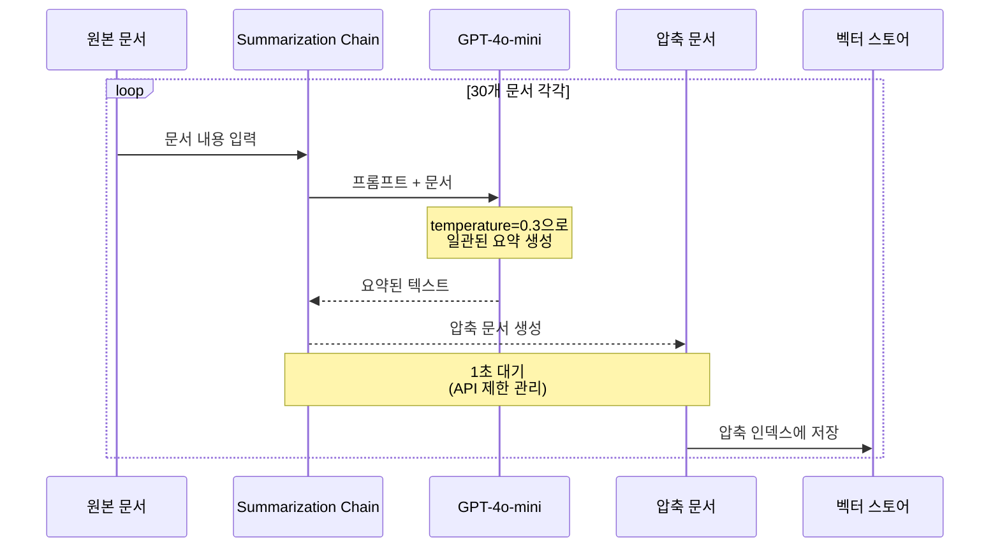
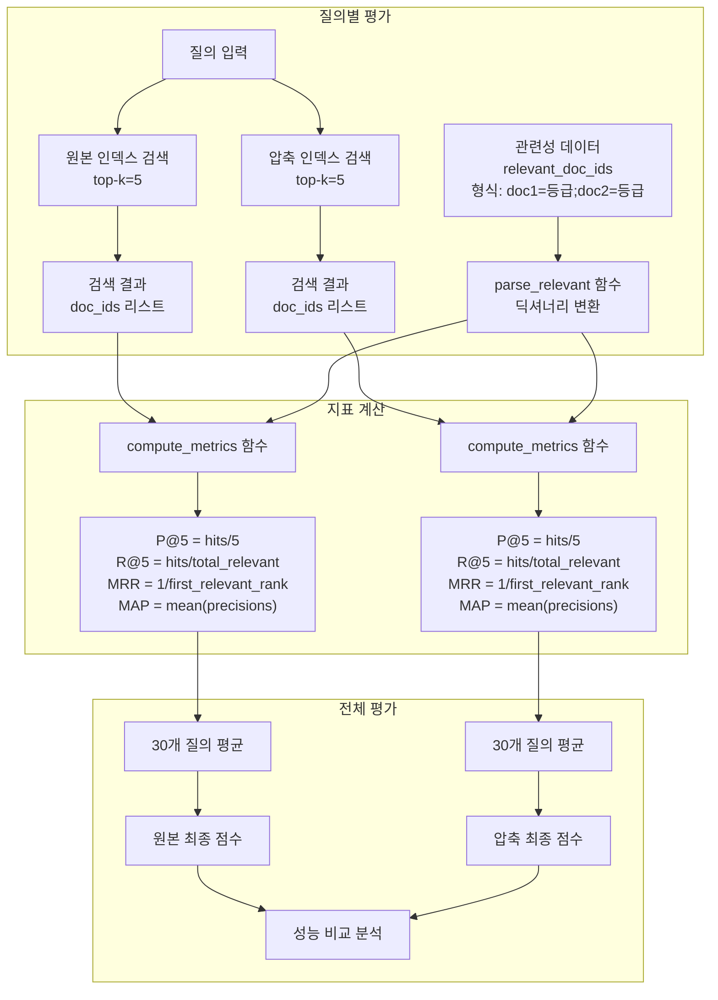
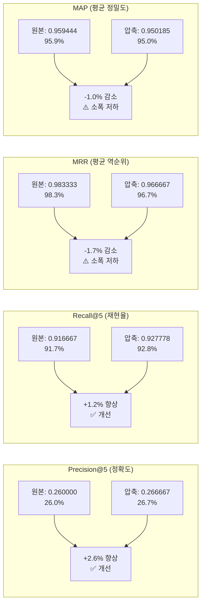
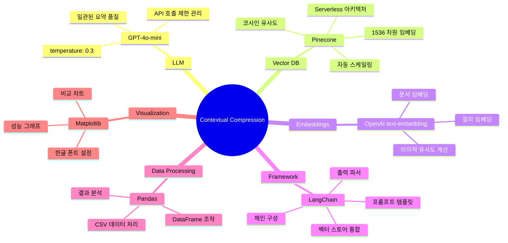
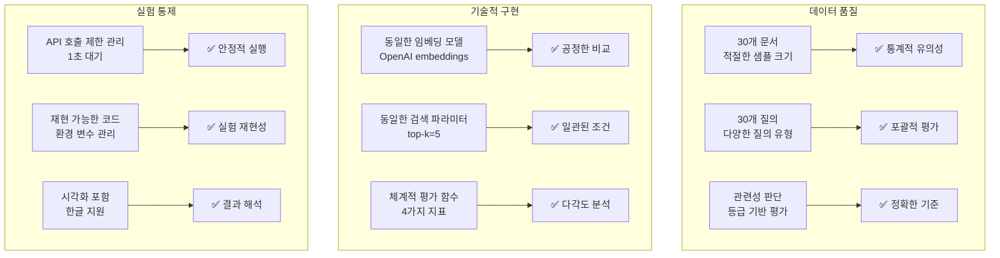
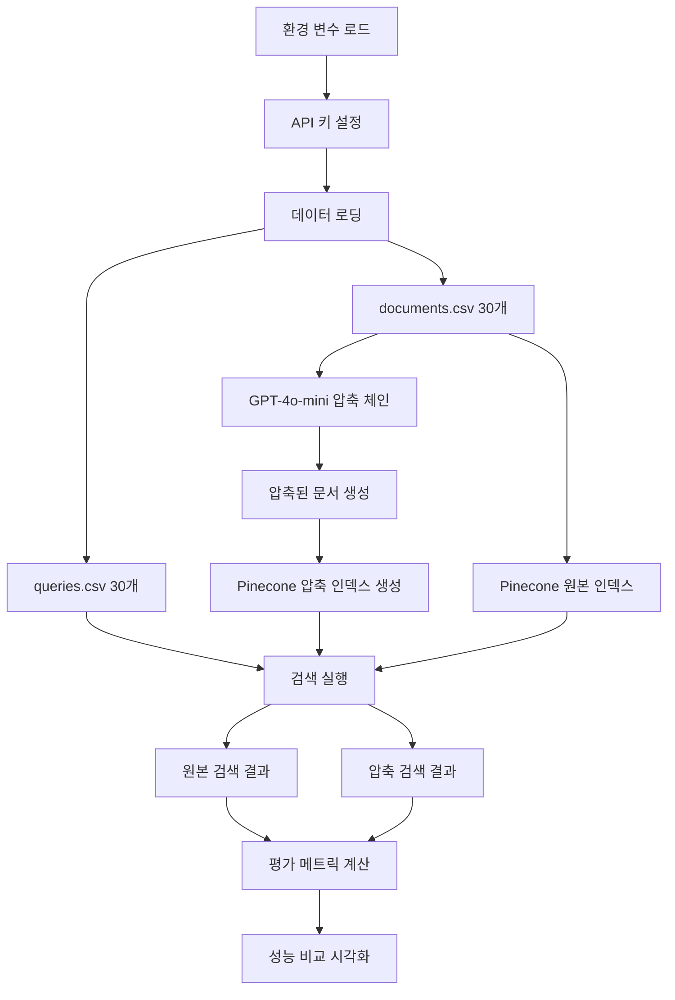

# Contextual Compression 상세 분석 - Mermaid 다이어그램

## 1. 전체 시스템 아키텍처

```mermaid
graph TD
    A[documents.csv - 30개 원본 문서] --> B[GPT-4o-mini 압축]
    B --> C[압축된 문서 30개]
    
    A --> D[원본 Pinecone 인덱스]
    C --> E[압축 Pinecone 인덱스]
    
    F[queries.csv - 30개 질의] --> G[검색 실행]
    D --> G
    E --> G
    
    G --> H[성능 비교]
    H --> I[P@5, R@5, MRR, MAP]
    
    J[환경 설정] --> B
    J --> D
    J --> E
```

## 2. 문서 압축 워크플로우



## 3. 평가 메트릭 계산 과정



## 4. 성능 비교 결과 상세



## 5. 기술 스택 상세



## 6. 실험 설계 검증 포인트



## 7. 실제 구현 세부사항



이 상세한 mermaid 다이어그램들은 실험의 모든 단계와 기술적 세부사항을 명확하게 보여줍니다!
