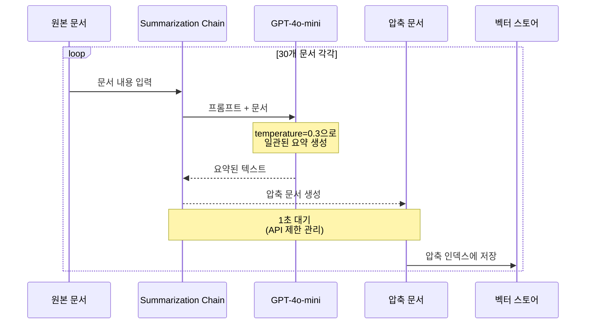
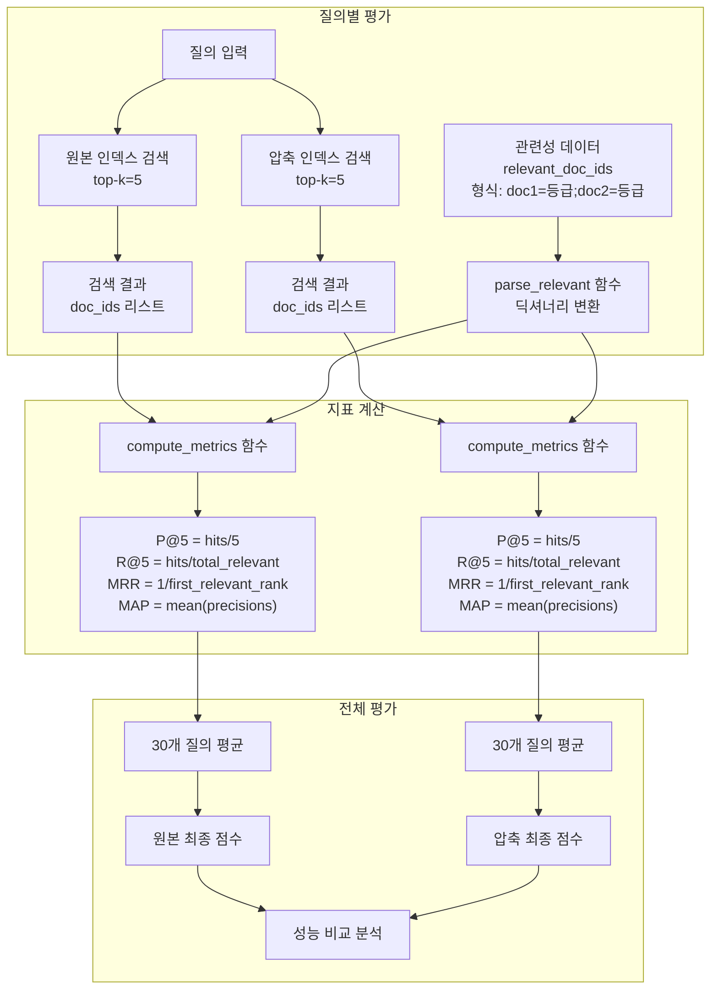
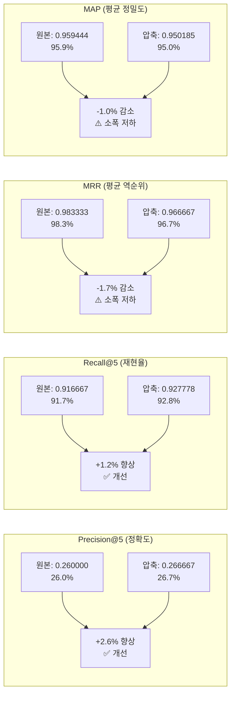
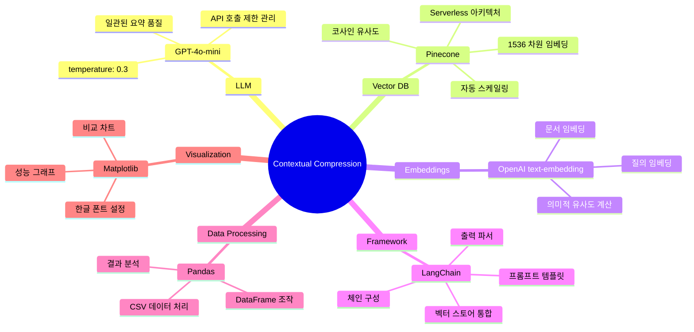
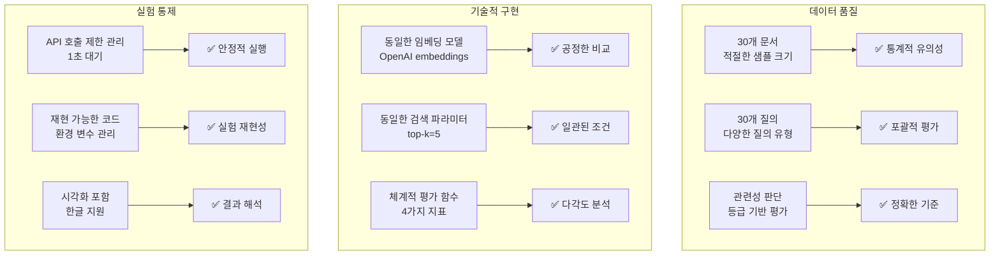

# Contextual Compression 상세 분석 - Mermaid 다이어그램

## 1. 전체 시스템 아키텍처

```mermaid
graph TB
    subgraph "데이터 준비"
        A[documents.csv<br/>30개 원본 문서] 
        B[queries.csv<br/>30개 검색 질의<br/>관련성 판단 포함]
    end
    
    subgraph "환경 설정"
        C[".env 파일<br/>- OPENAI_API_KEY<br/>- PINECONE_API_KEY<br/>- 모델 설정"]
        D["라이브러리 설치<br/>- langchain<br/>- pinecone<br/>- openai<br/>- pandas<br/>- matplotlib"]
    end
    
    subgraph "GPT-4o-mini 압축 과정"
        E["ChatOpenAI<br/>model: gpt-4o-mini<br/>temperature: 0.3"]
        F["PromptTemplate<br/>'핵심 내용을 짧고<br/>간결하게 요약하세요'"]
        G[StrOutputParser]
        H[summarization_chain<br/>= prompt | model | parser]
        
        E --> H
        F --> H
        G --> H
    end
    
    subgraph "Pinecone 벡터 인덱스"
        I["원본 인덱스: 'ir'<br/>- dimension: 1536<br/>- metric: cosine<br/>- 원본 문서 30개"]
        J["압축 인덱스: 'ir-compressed'<br/>- dimension: 1536<br/>- metric: cosine<br/>- 요약 문서 30개"]
    end
    
    A --> H
    H --> K[압축된 문서 30개<br/>DataFrame 생성]
    K --> J
    A --> I
    
    B --> L[검색 실행]
    I --> L
    J --> L
    
    L --> M[성능 평가<br/>4가지 지표]
```

## 2. 문서 압축 워크플로우



## 3. 평가 메트릭 계산 과정



## 4. 성능 비교 결과 상세



## 5. 기술 스택 상세



## 6. 실험 설계 검증 포인트



## 7. 실제 구현 세부사항

```mermaid
flowchart TD
    subgraph "환경 초기화"
        A[.env 파일 로드] --> B[API 키 설정]
        B --> C[모델 파라미터 설정]
        C --> D[Pinecone 연결]
    end
    
    subgraph "데이터 로딩"
        E[documents.csv 로드<br/>30개 문서] --> F[queries.csv 로드<br/>30개 질의]
        F --> G[관련성 데이터 파싱<br/>형식: doc1=grade;doc2=grade]
    end
    
    subgraph "압축 처리"
        H[ChatOpenAI 인스턴스<br/>gpt-4o-mini, temp=0.3] --> I[PromptTemplate 생성<br/>요약 지시사항]
        I --> J[체인 구성<br/>prompt | model | parser]
        J --> K[30개 문서 순차 처리<br/>각각 1초 대기]
        K --> L[압축 DataFrame 생성]
    end
    
    subgraph "벡터 인덱스 구성"
        M[기존 'ir' 인덱스 확인] --> N[신규 'ir-compressed' 인덱스 생성]
        N --> O[OpenAI 임베딩 모델 설정]
        O --> P[PineconeVectorStore 인스턴스<br/>원본 & 압축용]
        L --> Q[압축 문서 업서트<br/>Document 객체로 변환]
        Q --> P
    end
    
    subgraph "검색 & 평가"
        R[30개 질의 순차 처리] --> S[원본 인덱스 검색<br/>similarity_search, k=5]
        R --> T[압축 인덱스 검색<br/>similarity_search, k=5]
        S --> U[결과 수집<br/>doc_id 추출]
        T --> U
        U --> V[평가 함수 실행<br/>P@5, R@5, MRR, MAP]
        V --> W[결과 비교 & 시각화]
    end
```

이 상세한 mermaid 다이어그램들은 실험의 모든 단계와 기술적 세부사항을 명확하게 보여줍니다!
